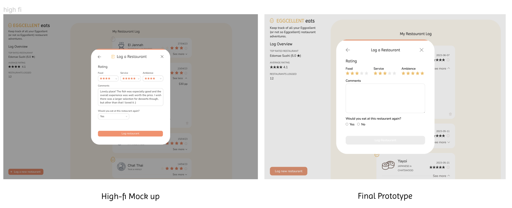
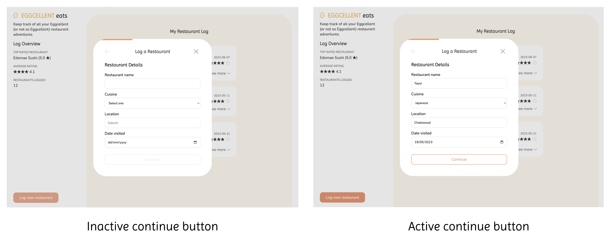
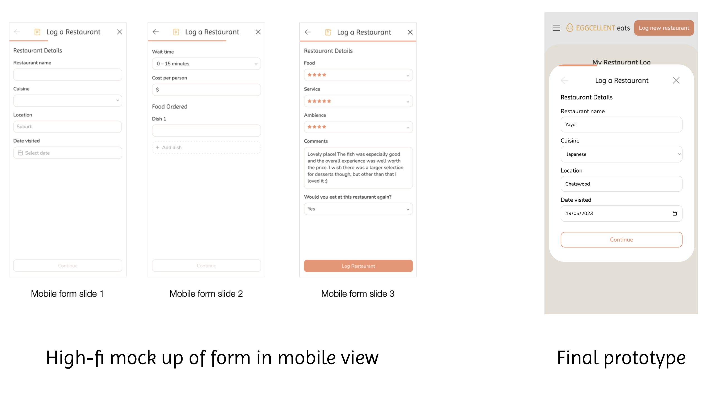
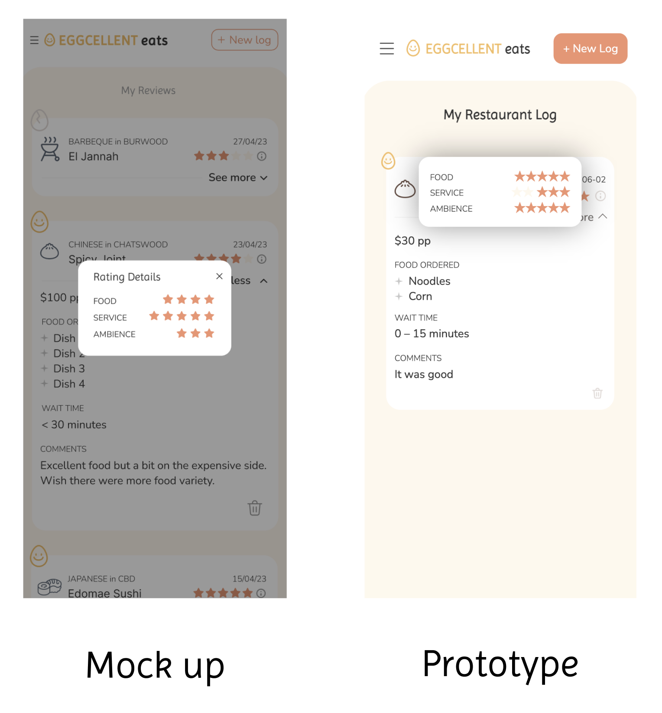

# Eggcellent Eats Overview

## Ideal Viewing Dimension

**Desktop:** 1400px

**Mobile:** 400px

## Set up

1. Install [Node.js](https://nodejs.org/en/)
2. Clone this repository
3. To install dependencies, use the terminal and run `npm install`
4. Using the terminal, run `npm run dev` to start the web server
5. Check the terminal to see where the server is being hosted
6. Copy and paste the above URL in your web browser

## The Concept

Food culture and dining experiences are increasingly more important to individuals in our current society. Foodies, families and friends alike are constantly on the lookout for new dining spots and hidden gems. With so many options and preferences, it becomes challenging to remember the unique aspects of each dining experience, whether it's that perfect dish, the exceptional service or the ambience. Current restaurant review platforms, such as Google and Zomato, fail to cater to those who prefer to keep their dining experiences private or only wish to share them with a select group of friends and family. Further, the data stored on these platforms is unstructured and less personalised, restricting the value of the information for making informed dining decisions. This is where Eggcellent Eats comes in - an app designed to help individuals track their restaurant experiences, acting as a personal journal and a reference guide.

# The prototype

## Form

I received feedback from the design assessment task from Annie saying that:

> A sider scale may be more appropriate for the rating options.

Consequently I with the help of the resources in the week 13 module, I used the star rating design instead, as shown below.

I also received feedback saying that:

> It would be good to see some user errors and how the web app would respond such as if they don't add all the required fields when trying to submit a restaurant.

I decided that rather than have error messages, I could instead disable the continue button of the multistep form to suggest validation as shown below.

The left side shows an inactive continue button when form fields are not inputted and right side shows an active continue button when all fields have user input.

Another change from my inital high-fidelity mock up is the appearance of the form on mobile view. Initally I had it as a full screen modal, however I realised that the pop up modal aesthetic would still function fine on mobile so I kept it consistent across desktop and mobile instead. This also means that the use can clearly see that the log a restaurant form opens in a modal and does not navigate them away from the rest of the app.

A problem I encountered was that for the mobile version, I had trouble getting the backdrop to show when the expanded star rating panel was opened. On desktop, as it was a hover interaction, this modal showed on the side. However due to the structure of the HTML I was unable to replicate my inital design. In the end, I changed the backdrop design to a box shadow, to differentiate between the modal and the list. However, this was not ideal and unfortunately is simply an easy fix.

# Further Development ideas

- Create filter sorting function to sort restaurants by rating, location, cuisine etc
- Add more cuisine options or allow user to input their cuisine options and images
- Create a visual map with restaurant locations
- More logged restaurant stats such as 'most logged cuisine', 'most expensive restaurant' etc etc. This could also be represented visually with charts or graphs
- Allow the user to upload images to add to their log and create a photo slideshow for each restaurant entry
- Add more rating options, so that users are not limited to whole number ratings out of 5
- Perhaps using consistent stars across app as I switched from using images to text stars. Maybe implementing a partially shaded star component so that partial ratings such as 4.5 stars will show 4 and a half stars coloured – currently it's determinded by the nearest integer
- Currently there is no deletion confirmation modal, so an entry will be immediately deleted if the delete icon is pressed. In the future, a confirmation will be useful to ensure entries are not deleted by accident.
- More animations could be added to make the app less static looking

# References

- Iconoir. (n.d.) Egg [Image]. Retrieved from https://iconoir.com/
- Freepik. (n.d.). Dumping [Image]. Retrieved from https://www.flaticon.com/free-icon/dumpling_678078
- Freepik. (n.d.). Sushi [Image]. Retrieved from https://www.flaticon.com/free-icon/sushi_1539701
- Freepik. (n.d.). Thai Food [Image]. Retrieved from https://www.flaticon.com/free-icon/thai-food_5137236
- Freepik (n.d.). Tzatziki [Image] Retrieved from https://www.flaticon.com/free-icon/tzatziki_6476203
- Freepik (n.d.). Pizza [Image] Retrieved from https://www.flaticon.com/free-icon/pizza_599995
- mangsaabguru (n.d.). Noodle [Image] Retrieved from https://www.flaticon.com/free-icon/noodle_2510368
